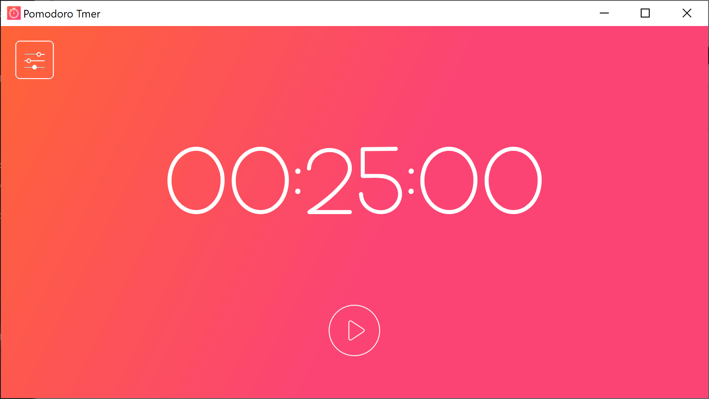
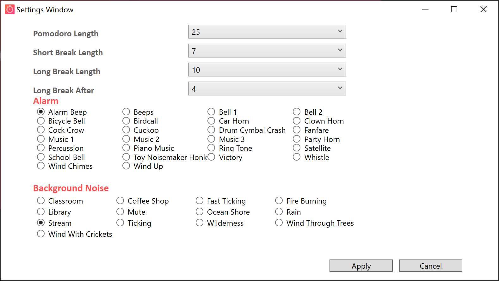

# Pomodoro Timer
This application is a basic lightweight Pomodoro timer intended to aid with studying build in C# using WPF. This was done in order to assist in my studying as well as to further explore the WPF architecture, specifically radio buttons.

## Prerequisites
This program requires no prerequisites.

## Built With
This program was built with no external libraries, just the base C# system libraries.

## Authors
  * **Shaan Khan** - *All Work*

## License
This project is licensed under the Mozilla Public License 2.0 - see the [LICENSE](https://github.com/ShaanCoding/Pomodoro-Timer/blob/master/LICENSE) files for details
